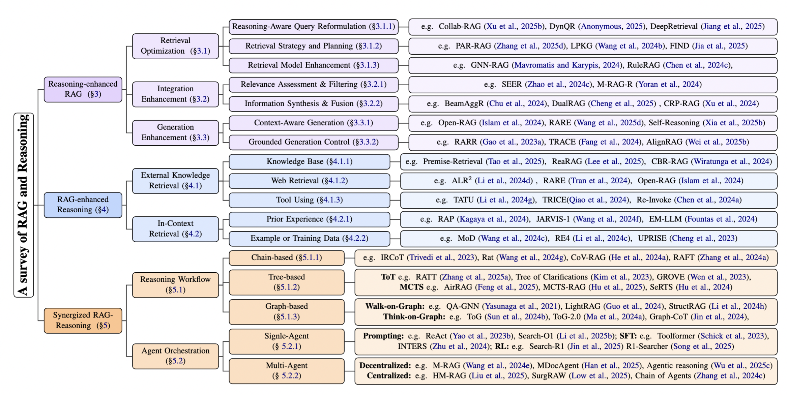
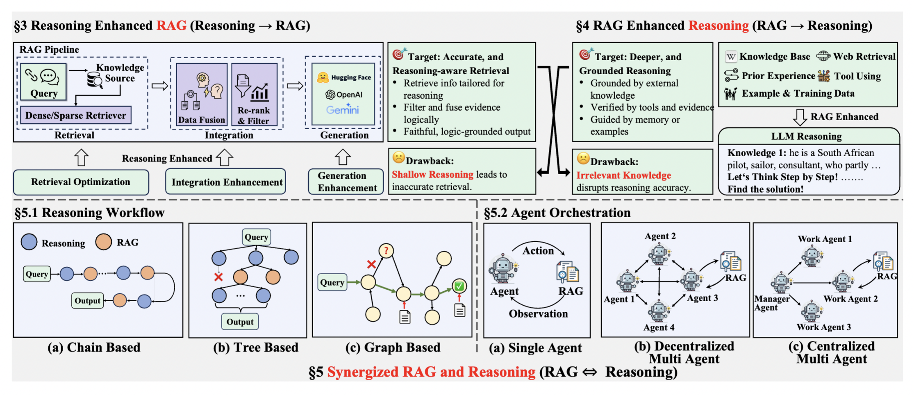

# Awesome-RAG-Reasoning

[](https://awesome.re)
[]()
[]()
[]()
[](https://github.com/DavidZWZ/Awesome-RAG-Reasoning) 
[](https://opensource.org/licenses/MIT)


<p align="center">
  
</p>

A curated collection of resources, papers, tools, and implementations that bridge the gap between **Retrieval-Augmented Generation (RAG)** and **Reasoning** in Large Language Models and Agents. This repository brings together traditionally separate research domains to enable more powerful Agentic AI systems.

**📖 Related Survey**: This repository is based on the taxonomy and framework presented in [**"Towards Agentic RAG with Deep Reasoning: A Survey of RAG-Reasoning Systems in LLMs"**](https://arxiv.org/abs/2507.09477), featured 🏆 in [Hugging Face Daily Papers](https://huggingface.co/papers/date/2025-07-17). 

**🔍 Dive Deeper**: For researchers interested in the latest developments in **Agentic Deep Research**, including cutting-edge papers and industry-leading deep research products, we recommend exploring our comprehensive collection at [**Awesome-Deep-Research**](https://github.com/DavidZWZ/Awesome-Deep-Research) 🔥🔥🔥.

If you find this repository useful, please cite our papers:

```bibtex
@article{li2025towards,
  title={Towards Agentic RAG with Deep Reasoning: A Survey of RAG-Reasoning Systems in LLMs},
  author={Li, Yangning and Zhang, Weizhi and Yang, Yuyao and Huang, Wei-Chieh and Wu, Yaozu and Luo, Junyu and Bei, Yuanchen and Zou, Henry Peng and Luo, Xiao and Zhao, Yusheng and others},
  journal={arXiv preprint arXiv:2507.09477},
  year={2025}
}

@article{zhang2025web,
  title={From Web Search towards Agentic Deep Research: Incentivizing Search with Reasoning Agents},
  author={Zhang, Weizhi and Li, Yangning and Bei, Yuanchen and Luo, Junyu and Wan, Guancheng and Yang, Liangwei and Xie, Chenxuan and Yang, Yuyao and Huang, Wei-Chieh and Miao, Chunyu and others},
  journal={arXiv preprint arXiv:2506.18959},
  year={2025}
}
```

## 📖 Introduction

**🔍 Retrieval-Augmented Generation (RAG)** has emerged as a powerful paradigm that combines the strengths of large language models with external knowledge retrieval. By augmenting language models with relevant information from external sources, RAG systems can provide more accurate, up-to-date, and factual responses while maintaining the generative capabilities of modern LLMs.
- **Limitations**:
  - May retrieve irrelevant or inaccurate information
  - Limited by the quality and coverage of external knowledge bases

**🧠 Reasoning** has recently gained significant popularity as a complementary approach to enhance LLM performance. Reasoning techniques focus on improving the model's ability to process information, perform logical analysis, and arrive at conclusions through structured thinking processes. These methods enable LLMs to tackle complex problems that require multi-step inference, causal understanding, and systematic problem-solving.
- **Limitations**:
  - Often hallucinates or mis-grounds facts
  - Struggles with up-to-date or domain-specific information

Although RAG and Reasoning address different aspects of the model's capabilities. **they have been developed largely independently**, with separate research communities, methodologies, and evaluation benchmarks:

**This repository serves as a comprehensive collection that bridges these traditionally separate domains**, providing resources for researchers and practitioners interested in combining the strengths of both approaches.

<p align="center">
  
</p>

### Why RAG + Reasoning?
Large Language Models (LLMs) serve as the foundation for modern AI systems, but they face significant limitations in both knowledge access and reasoning capabilities. 
While RAG excels at providing factual knowledge and reasoning excels at logical processing, real-world problems often require both capabilities simultaneously. Complex queries demand not just access to relevant information, but also the ability to reason through that information systematically.

**Real-World Impact**: This combination enables AI systems to tackle complex problems that require both knowledge retrieval and sophisticated reasoning, such as scientific research, legal analysis, medical diagnosis, and strategic planning.

<p align="center">
  
</p>

*The **Reasoning-Enhanced RAG** methods and **RAG-Enhanced Reasoning** methods represent **one-way** enhancements. In contrast, the **Synergized RAG-Reasoning System** performs reasoning and retrieval **iteratively**, enabling mutual enhancements.*

---
## What This Repository Covers

Below you will find a curated selection of research papers, open-source implementations, and benchmarking datasets that drive progress in RAG and Reasoning.

### 📚 [Research Papers & Frameworks](#research-papers-and-frameworks)
Latest academic publications and open-source implementations that advance the integration of RAG and Reasoning. 

- [Reasoning-Enhanced RAG](#reasoning-enhanced-rag)
  - [Retrieval Optimization](#retrieval-optimization)
  - [Integration Enhancement](#integration-enhancement) 
  - [Generation Enhancement](#generation-enhancement)

- [RAG-Enhanced Reasoning](#rag-enhanced-reasoning)
  - [External Knowledge Retrieval](#external-knowledge-retrieval)
    - [Knowledge Base](#knowledge-base)
    - [Web Retrieval](#web-retrieval)
    - [Tool Using](#tool-using)
  - [In-context Retrieval](#in-context-retrieval)
    - [Prior Experience](#prior-experience)
    - [Example or Training Data](#example-or-training-data)

- [Synergized RAG and Reasoning](#synergized-rag-and-reasoning)
  - [Reasoning Workflow](#reasoning-workflow)
    - [Chain-based](#chain-based)
    - [Tree-based](#tree-based)
    - [Graph-based](#graph-based)
      - [Walk-on-Graph](#walk-on-graph)
      - [Think-on-Graph](#think-on-graph)
  - [Agentic Orchestration](#agentic-orchestration)
    - [Single-Agent](#single-agent)
      - [Prompting](#prompting)
      - [Supervised Fine-Tuning](#supervised-fine-tuning)
      - [Reinforcement Learning](#reinforcement-learning)
    - [Multi-Agent](#multi-agent)

---

### 📊 [Benchmarks & Datasets](#benchmarks-and-datasets)

The table linked below covers a diverse range of tasks. Each benchmark is annotated with its domain, knowledge type, reasoning capability, and dataset size. 

- [Single-hop QA](#single-hop-qa)
- [Multi-hop QA](#multi-hop-qa)
- [Multi-choice QA](#multi-choice-qa)
- [Multi-step QA](#multi-step-qa)
- [Multimodal QA](#multimodal-qa)
- [Long-form QA](#long-form-qa)
- [Graph QA](#graph-qa)
- [Code](#code)
- [Dialog](#dialog)
- [Fact Checking](#fact-checking)
- [Text Summarization](#text-summarization)

### 🤝 [Contributing](#contributing)

Guidelines for contributing to this repository and adding citation information.

---
<a name="research-papers-and-frameworks"></a>
📚 **Research Papers and Frameworks**: This section is organized according to the taxonomy in our research paper, providing resources for researchers and practitioners to explore, implement, and motivate new methods in the field.

## Reasoning-Enhanced RAG
### Retrieval Optimization
- (AAAI 2025) **MaFeRw: Query Rewriting with Multi-Aspect Feedbacks for Retrieval-Augmented Large Language Models** [[Paper]](https://ojs.aaai.org/index.php/AAAI/article/view/34732) [[Code]](https://github.com/yjEugenia/MaFeRw) 
- (ArXiv 2025) **Collab-RAG: Boosting Retrieval-Augmented Generation for Complex Question Answering via White-Box and Black-Box LLM Collaboration** [[Paper]](https://arxiv.org/abs/2504.04915) [[Code]](https://github.com/ritaranx/Collab-RAG/) 
- (ArXiv 2025) **DeepRetrieval: Hacking Real Search Engines and Retrievers with Large Language Models via Reinforcement Learning** [[Paper]](https://arxiv.org/abs/2503.00223) [[Code]](https://github.com/pat-jj/DeepRetrieval) 
- (ArXiv 2025) **Credible plan-driven rag method for multi-hop question answering** [[Paper]](https://arxiv.org/abs/2504.16787)
- (ArXiv 2025) **FIND: Fine-grained Information Density Guided Adaptive Retrieval-Augmented Generation for Disease Diagnosis** [[Paper]](https://arxiv.org/abs/2502.14614)
- (ArXiv 2025) **LLM-Independent Adaptive RAG: Let the Question Speak for Itself** [[Paper]](https://arxiv.org/abs/2505.04253) [[Code]](https://github.com/marialysyuk/External_Adaptive_Retrieval) 

- (ACL 2024) **Chain-of-Verification Reduces Hallucination in Large Language Models** [[Paper]](https://aclanthology.org/2024.findings-acl.212/)
- (EMNLP 2024) **Learning to Plan for Retrieval-Augmented Large Language Models from Knowledge Graphs** [[Paper]](https://aclanthology.org/2024.findings-emnlp.459/) [[Code]](https://github.com/zjukg/LPKG) 
- (EMNLP 2024) **Retrieval and Reasoning on KGs: Integrate Knowledge Graphs into Large Language Models for Complex Question Answering** [[Paper]](https://aclanthology.org/2024.findings-emnlp.446/) [[Code]](https://github.com/Dereck0602/Retrieval-and-Reasoning-on-KGs) 
- (NAACL 2024) **Adaptive-RAG: Learning to Adapt Retrieval-Augmented Large Language Models through Question Complexity** [[Paper]](https://arxiv.org/abs/2403.14403) [[Code]](https://github.com/starsuzi/Adaptive-RAG) 
- (SIGIR 2024) **Can Query Expansion Improve Generalization of Strong Cross-Encoder Rankers?** [[Paper]](https://arxiv.org/abs/2311.09175)
- (LREC-COLING 2024) **RADCoT: Retrieval-Augmented Distillation to Specialization Models for Generating Chain-of-Thoughts in Query Expansion** [[Paper]](https://aclanthology.org/2024.lrec-main.1182/) [[Code]](https://github.com/ZIZUN/RADCoT) 
- (ArXiv 2024) **GNN-RAG: Graph Neural Retrieval for Large Language Model Reasoning** [[Paper]](https://arxiv.org/abs/2405.20139) [[Code]](https://github.com/cmavro/GNN-RAG) 
- (ArXiv 2024) **RuleRAG: Rule-Guided Retrieval-Augmented Generation with Language Models for Question Answering** [[Paper]](https://arxiv.org/abs/2410.22353) [[Code]](https://anonymous.4open.science/r/RuleRAG)

### Integration Enhancement
- (ArXiv 2025) **DualRAG: A Dual-Process Approach to Integrate Reasoning and Retrieval for Multi-Hop Question Answering** [[Paper]](https://arxiv.org/abs/2504.18243)

- (EMNLP 2024) **SEER: Self-Aligned Evidence Extraction for Retrieval-Augmented Generation** [[Paper]](https://aclanthology.org/2024.emnlp-main.178/) [[Code]](https://github.com/HITsz-TMG/SEER) 
- (ICLR 2024) **Making Retrieval-Augmented Language Models Robust to Irrelevant Context** [[Paper]](https://openreview.net/forum?id=ZS4m74kZpH) [[Code]](https://github.com/oriyor/ret-robust) 
- (ACL 2024) **BeamAggR: Beam Aggregation Reasoning over Multi-source Knowledge for Multi-hop Question Answering** [[Paper]](https://aclanthology.org/2024.acl-long.67/)

### Generation Enhancement
- (AAAI 2025) **Improving Retrieval Augmented Language Model with Self-Reasoning** [[Paper]](https://ojs.aaai.org/index.php/AAAI/article/view/34743)
- (ArXiv 2025) **RARE: Retrieval-Augmented Reasoning Enhancement for Large Language Models** [[Paper]](https://arxiv.org/abs/2503.23513)
- (ArXiv 2025) **AlignRAG: Leveraging Critique Learning for Evidence-Sensitive Retrieval-Augmented Reasoning** [[Paper]](https://arxiv.org/pdf/2504.14858v3) [[Code]](https://github.com/QQW-ing/RAG-ReasonAlignment) 

- (EMNLP 2024) **Open-RAG: Enhanced Retrieval Augmented Reasoning with Open-Source Large Language Models** [[Paper]](https://aclanthology.org/2024.findings-emnlp.831/) [[Code]](https://github.com/ShayekhBinIslam/openrag) 
- (EMNLP 2024) **TRACE the evidence: Constructing knowledge-grounded reasoning chains for retrieval-augmented generation** [[Paper]](https://arxiv.org/abs/2406.11460) [[Code]](https://github.com/jyfang6/trace) 

**[⬆️ Back to Table of Contents](#what-this-repository-covers)**

## RAG-Enhanced Reasoning
### External Knowledge Retrieval
#### Knowledge Base
- (ICLR 2025) **KBLaM: Knowledge Base augmented Language Model** [[Paper]](https://arxiv.org/pdf/2410.10450) [[Code]](https://github.com/microsoft/KBLaM/) 
- (ArXiv 2025) **Assisting Mathematical Formalization with A Learning-based Premise Retriever** [[Paper]](https://arxiv.org/pdf/2501.13959) [[Code]](https://github.com/ruc-ai4math/Premise-Retrieval) 
- (ArXiv 2025) **ReaRAG: Knowledge-guided Reasoning Enhances Factuality of Large Reasoning Models with Iterative Retrieval Augmented Generation** [[Paper]](https://arxiv.org/pdf/2503.21729) [[Code]](https://github.com/THU-KEG/ReaRAG) 
- (ArXiv 2025) **Scaling Test-Time Inference with Policy-Optimized, Dynamic Retrieval-Augmented Generation via KV Caching and Decoding** [[Paper]](https://arxiv.org/pdf/2504.01281?)
- (ArXiv 2025) **PIKE-RAG: sPecIalized KnowledgE and Rationale Augmented Generation** [[Paper]](https://arxiv.org/pdf/2501.11551) [[Code]](https://github.com/microsoft/PIKE-RAG?tab=readme-ov-file) 

- (SIGIR 2024) **Retrieval-Augmented Generation with Knowledge Graphs for Customer Service Question Answering** [[Paper]](https://dl.acm.org/doi/abs/10.1145/3626772.3661370)
- (ICCBR 2024) **CBR-RAG: Case-Based Reasoning for Retrieval Augmented Generation in LLMs for Legal Question Answering** [[Paper]](https://link.springer.com/chapter/10.1007/978-3-031-63646-2_29) [[Code]](https://github.com/rgu-iit-bt/cbr-for-legal-rag) 
- (LLM4Code 2024) **LLM-based and Retrieval-Augmented Control Code Generation** [[Paper]](https://dl.acm.org/doi/abs/10.1145/3643795.3648384)
- (ArXiv 2024) **MultiHop-RAG: Benchmarking Retrieval-Augmented Generation for Multi-Hop Queries** [[Paper]](https://arxiv.org/pdf/2401.15391) [[Code]](https://github.com/yixuantt/MultiHop-RAG/) 
- (MDPI 2024) **CRP-RAG: A Retrieval-Augmented Generation Framework for Supporting Complex Logical Reasoning and Knowledge Planning** [[Paper]](https://www.mdpi.com/2079-9292/14/1/47)

#### Web Retrieval

- (ICTIR 2025) **Distillation and Refinement of Reasoning in Small Language Models for Document Re-ranking** [[Paper]](https://arxiv.org/pdf/2504.03947) [[Code]](https://github.com/algoprog/InteRank) 
- (NAACL 2025) **Step-by-Step Fact Verification System for Medical Claims with Explainable Reasoning** [[Paper]](https://aclanthology.org/2025.naacl-short.68.pdf) [[Code]](https://github.com/jvladika/StepByStepFV) 

- (COLM 2024) **Web Retrieval Agents for Evidence-Based Misinformation Detection** [[Paper]](https://openreview.net/pdf?id=pKMxO0wBYZ) [[Code]](https://github.com/ComplexData-MILA/webretrieval) 
- (EMNLP 2024) **OPEN-RAG: Enhanced Retrieval-Augmented Reasoning with Open-Source Large Language Models** [[Paper]](https://aclanthology.org/2024.findings-emnlp.831.pdf) [[Code]](https://github.com/ShayekhBinIslam/openrag?tab=readme-ov-file) 
- (ACL 2024) **FRVA: Fact-Retrieval and Verification Augmented Entailment Tree Generation for Explainable Question Answering** [[Paper]](https://aclanthology.org/2024.findings-acl.540.pdf)
- (FEVER 2024) **Ragar, your falsehood radar: Rag-augmented reasoning for political fact-checking using multimodal large language models** [[Paper]](https://arxiv.org/pdf/2404.12065)
- (LREC-COLING 2024) **PACAR: Automated Fact-Checking with Planning and Customized Action Reasoning using Large Language Models** [[Paper]](https://aclanthology.org/2024.lrec-main.1099.pdf)

#### Tool Using

- (COLING 2025) **Efficient Tool Use with Chain-of-Abstraction Reasoning** [[Paper]](https://aclanthology.org/2025.coling-main.185.pdf)
- (NAACL 2025) **Meta-Reasoning Improves Tool Use in Large Language Models** [[Paper]](https://arxiv.org/pdf/2411.04535) [[Code]](https://github.com/lisaalaz/tecton?tab=readme-ov-file) 
- (ArXiv 2025) **Self-Training Large Language Models for Tool-Use Without Demonstrations** [[Paper]](https://arxiv.org/pdf/2502.05867) [[Code]](https://github.com/neneluo/llm-tool-use) 

- (ICLR 2024) **Large Language Models As Tool Makers** [[Paper]](https://arxiv.org/pdf/2305.17126) [[Code]](https://github.com/ctlllll/LLM-ToolMaker) 
- (ICLR 2024) **ToolLLM: Facilitating Large Language Models to Master 16000+ Real-world APIs** [[Paper]](https://openreview.net/pdf?id=dHng2O0Jjr) [[Code]](https://github.com/OpenBMB/ToolBench) 
- (NeurIPS 2024) **AVATAR: Optimizing LLM Agents for Tool Usage via Contrastive Reasoning** [[Paper]](https://proceedings.neurips.cc/paper_files/paper/2024/file/2db8ce969b000fe0b3fb172490c33ce8-Paper-Conference.pdf) [[Code]](https://github.com/zou-group/avatar) 
- (EMNLP 2024) **Re-Invoke: Tool Invocation Rewriting for Zero-Shot Tool Retrieval** [[Paper]](https://aclanthology.org/2024.findings-emnlp.270.pdf)
- (EMNLP 2024) **SCIAGENT: Tool-augmented Language Models for Scientific Reasoning** [[Paper]](https://aclanthology.org/2024.emnlp-main.880.pdf)
- (EMNLP 2024) **RAR: Retrieval-augmented retrieval for code generation in low-resource languages** [[Paper]](https://aclanthology.org/2024.emnlp-main.1199.pdf)
- (ACL 2024) **MORE: Multi-mOdal REtrieval Augmented Generative Commonsense Reasoning** [[Paper]](https://aclanthology.org/2024.findings-acl.69.pdf) [[Code]](https://github.com/VickiCui/MORE) 
- (LREC-COLING 2024) **Towards Autonomous Tool Utilization in Language Models: A Unified, Efficient and Scalable Framework** [[Paper]](https://aclanthology.org/2024.lrec-main.1427.pdf)
- (NAACL 2024) **Making Language Models Better Tool Learners with Execution Feedback** [[Paper]](https://aclanthology.org/2024.naacl-long.195.pdf) [[Code]](https://github.com/zjunlp/TRICE) 

- (NeurIPS 2023) **ToolkenGPT: Augmenting Frozen Language Models with Massive Tools via Tool Embeddings** [[Paper]](https://proceedings.neurips.cc/paper_files/paper/2023/file/8fd1a81c882cd45f64958da6284f4a3f-Paper-Conference.pdf) [[Code]](https://github.com/Ber666/ToolkenGPT) 


### In-context Retrieval

#### Prior Experience

- (ICLR 2025) **Not All Heads Matter: A Head-Level KV Cache Compression Method with Integrated Retrieval and Reasoning** [[Paper]](https://arxiv.org/pdf/2410.19258?) [[Code]](https://github.com/FYYFU/HeadKV/tree/main) 
- (ICLR 2025) **Human-like Episodic Memory for Infinite Context LLMs** [[Paper]](https://openreview.net/pdf?id=BI2int5SAC)
- (IEEE TPAMI 2025) **JARVIS-1: Open-World Multi-Task Agents With Memory-Augmented Multimodal Language Models** [[Paper]](https://ieeexplore.ieee.org/stamp/stamp.jsp?arnumber=10778628&casa_token=gxJl_piLwrAAAAAA:UCDJkqg5WT7Hr2LSxZUwt6MDTxTH-FHDhL9Dw8XUFJWpcJJSsEMgC5u4wGhE4DvxATX2hK_0CSM)
- (ArXiv 2025) **Reasoning Under 1 Billion: Memory-Augmented Reinforcement Learning for Large Language Models** [[Paper]](https://arxiv.org/pdf/2504.02273)
- (ArXiv 2025) **Review of Case-Based Reasoning for LLM Agents: Theoretical Foundations, Architectural Components, and Cognitive Integration** [[Paper]](https://arxiv.org/pdf/2504.06943?)

- (NeurIPS 2024) **CoPS: Empowering LLM Agents with Provable Cross-Task Experience Sharing** [[Paper]](https://openreview.net/pdf?id=8DLW1saLEY) [[Code]](https://github.com/uclaml/COPS) 
- (CHI EA 2024) **"My agent understands me beter": Integrating Dynamic Human-like Memory Recall and Consolidation in LLM-Based** [[Paper]](https://dl.acm.org/doi/pdf/10.1145/3613905.3650839?casa_token=KFkWdHv3aSkAAAAA:lIuVvR1RFiX7HfJ67vl7FVRb5oOKqE1NDl0DSONyvGryZlt5q4WdL8rjp_24NHfcvf0KPAVWGtrBsg)
- (ArXiv 2024) **Large Language Models Orchestrating Structured Reasoning Achieve Kaggle Grandmaster Level** [[Paper]](https://arxiv.org/pdf/2411.03562)
- (ArXiv 2024) **RAP: Retrieval-Augmented Planning with Contextual Memory for Multimodal LLM Agents** [[Paper]](https://arxiv.org/pdf/2402.03610)

#### Example or Training Data

- (ICLR 2025) **OpenRAG: Optimizing RAG End-to-End viaIn-ContextRetrievalLearning** [[Paper]](https://openreview.net/pdf?id=WX0Y0rBsqo)
- (COLING 2025) **PERC: Plan-As-Query Example Retrieval for Underrepresented Code Generation** [[Paper]](https://aclanthology.org/2025.coling-main.534.pdf)

- (IJCAI 2024) **Recall, Retrieve and Reason: Towards Better In-Context Relation Extraction** [[Paper]](https://www.ijcai.org/proceedings/2024/0704.pdf)
- (NeurIPS 2024) **Mixture of Demonstrations for In-Context Learning** [[Paper]](https://proceedings.neurips.cc/paper_files/paper/2024/file/a0da098e0031f58269efdcba40eedf47-Paper-Conference.pdf) [[Code]](https://github.com/SongW-SW/MoD?tab=readme-ov-file) 
- (EACL 2024) **Learning to Retrieve In-Context Examples for Large Language Models** [[Paper]](https://aclanthology.org/2024.eacl-long.105.pdf) [[Code]](https://github.com/microsoft/LMOps/tree/main/llm_retriever) 

- (EMNLP 2023) **UPRISE: Universal Prompt Retrieval for Improving Zero-Shot Evaluation** [[Paper]](https://aclanthology.org/2023.emnlp-main.758.pdf) [[Code]](https://github.com/microsoft/LMOps) 
- (ArXiv 2023) **Dr.ICL: Demonstration-Retrieved In-context Learning** [[Paper]](https://arxiv.org/pdf/2305.14128)

**[⬆️ Back to Table of Contents](#what-this-repository-covers)**

## Synergized RAG and Reasoning

### Reasoning Workflow

#### Chain-based

- (ICLR 2025) **Long-context llms meet rag: Overcoming challenges for long inputs in rag** [[Paper]](https://openreview.net/forum?id=oU3tpaR8fm)
- (ArXiv 2025) **Chain-of-Retrieval Augmented Generation** [[Paper]](https://arxiv.org/abs/2501.14342) [[Code]](https://github.com/microsoft/LMOps/tree/main/corag) 
- (ArXiv 2025) **CoT-RAG: Integrating Chain of Thought and Retrieval-Augmented Generation to Enhance Reasoning in Large Language Models** [[Paper]](https://arxiv.org/abs/2504.13534)
- (ArXiv 2025) **Rankcot: Refining knowledge for retrieval-augmented generation through ranking chain-of-thoughts** [[Paper]](https://arxiv.org/abs/2502.17888) [[Code]](https://github.com/NEUIR/RankCoT) 

- (EMNLP 2024) **Retrieving, Rethinking and Revising: The Chain-of-Verification Can Improve Retrieval Augmented Generation** [[Paper]](https://arxiv.org/abs/2410.05801)
- (EMNLP 2024) **Chain-of-note: Enhancing robustness in retrieval-augmented language models** [[Paper]](https://arxiv.org/abs/2311.09210)
- (COLM 2024) **Raft: Adapting language model to domain specific rag** [[Paper]](https://openreview.net/pdf?id=rzQGHXNReU) [[Code]](https://github.com/ShishirPatil/gorilla) 
- (ArXiv 2024) **Rat: Retrieval augmented thoughts elicit context-aware reasoning in long-horizon generation** [[Paper]](https://arxiv.org/pdf/2403.05313) [[Code]](https://github.com/CraftJarvis/RAT) 
- (ArXiv 2024) **TRACE the evidence: Constructing knowledge-grounded reasoning chains for retrieval-augmented generation** [[Paper]](https://arxiv.org/abs/2406.11460) [[Code]](https://github.com/jyfang6/trace) 

- (ACL 2023) **Interleaving Retrieval with Chain-of-Thought Reasoning for Knowledge-Intensive Multi-Step Questions** [[Paper]](https://arxiv.org/pdf/2212.10509) [[Code]](https://github.com/stonybrooknlp/ircot) 

#### Tree-based

- (ACL 2025) **ARise: Towards Knowledge-Augmented Reasoning via Risk-Adaptive Search** [[Paper]](https://arxiv.org/abs/2504.10893) [[Code]](https://github.com/OpenCausaLab/ARise) 
- (AAAI 2025) **RATT: A Thought Structure for Coherent and Correct LLM Reasoning** [[Paper]](https://ojs.aaai.org/index.php/AAAI/article/view/34876) [[Code]](https://github.com/jinghanzhang1998/RATT) 
- (ArXiv 2025) **MCTS-RAG: Enhance Retrieval-Augmented Generation with Monte Carlo Tree Search** [[Paper]](https://arxiv.org/pdf/2503.20757?) [[Code]](https://github.com/yale-nlp/MCTS-RAG) 
- (ArXiv 2025) **Airrag: Activating intrinsic reasoning for retrieval augmented generation via tree-based search** [[Paper]](https://arxiv.org/abs/2501.10053)
- (ArXiv 2025) **Tree-based RAG-Agent Recommendation System: A Case Study in Medical Test Data** [[Paper]](https://arxiv.org/abs/2501.02727)

- (ArXiv 2024) **SeRTS: Self-Rewarding Tree Search for Biomedical Retrieval-Augmented Generation** [[Paper]](https://arxiv.org/abs/2406.11258)
- (ArXiv 2024) **CORAG: A Cost-Constrained Retrieval Optimization System for Retrieval-Augmented Generation** [[Paper]](https://arxiv.org/abs/2411.00744)

- (ACL 2023) **Tree of clarifications: Answering ambiguous questions with retrieval-augmented large language models** [[Paper]](https://aclanthology.org/2023.emnlp-main.63/) [[Code]](https://github.com/gankim/tree-of-clarifications) 
- (EMNLP 2023) **Grove: a retrieval-augmented complex story generation framework with a forest of evidence** [[Paper]](https://arxiv.org/abs/2310.05388)

#### Graph-based

##### Walk-on-Graph
- (ICLR 2025) **Reasoning of Large Language Models over Knowledge Graphs with Super-Relations** [[Paper]](https://openreview.net/forum?id=rTCJ29pkuA) [[Code]](https://github.com/SongW-SW/REKNOS) 
- (ICLR 2025) **Simple is Effective: The Roles of Graphs and LLMs in Knowledge-Graph-Based RAG** [[Paper]](https://arxiv.org/pdf/2410.20724) [[Code]](https://github.com/Graph-COM/SubgraphRAG) 
- (ICLR 2025) **StructRAG: Boosting Knowledge Intensive Reasoning of LLMs via Inference-time Hybrid Information Structurization** [[Paper]](https://arxiv.org/pdf/2410.08815) [[Code]](https://github.com/icip-cas/StructRAG) 
- (ArXiv 2025) **From RAG to Memory: Non-Parametric Continual Learning for Large Language Models** [[Paper]](https://arxiv.org/pdf/2502.14802) [[Code]](https://github.com/OSU-NLP-Group/HippoRAG) 
- (ArXiv 2025) **From Local to Global: A GraphRAG Approach to Query-Focused Summarization** [[Paper]](https://arxiv.org/pdf/2404.16130) [[Code]](https://github.com/ksachdeva/langchain-graphrag) 

- (NeurIPS 2024) **G-Retriever: Retrieval-Augmented Generation for Textual Graph Understanding and Question Answering** [[Paper]](https://arxiv.org/pdf/2402.07630) [[Code]](https://github.com/manthan2305/Efficient-G-Retriever) 
- (NeurIPS 2024) **HippoRAG: Neurobiologically Inspired Long-Term Memory for Large Language Models** [[Paper]](https://arxiv.org/pdf/2405.14831) [[Code]](https://github.com/OSU-NLP-Group/HippoRAG) 
- (ArXiv 2024) **DALK: Dynamic Co-Augmentation of LLMs and KG to answer Alzheimer's Disease Questions with Scientific Literature** [[Paper]](https://arxiv.org/pdf/2405.04819) [[Code]](https://github.com/David-Li0406/DALK) 
- (ArXiv 2024) **GNN-RAG: Graph Neural Retrieval for Large Language Model Reasoning** [[Paper]](https://arxiv.org/pdf/2405.20139) [[Code]](https://github.com/cmavro/GNN-RAG) 
- (ArXiv 2024) **LightRAG: Simple and Fast Retrieval-Augmented Generation** [[Paper]](https://arxiv.org/pdf/2410.05779) [[Code]](https://github.com/HKUDS/LightRAG) 

- (ArXiv 2023) **Retrieve-Rewrite-Answer: A KG-to-Text Enhanced LLMs Framework for Knowledge Graph Question Answering** [[Paper]](https://arxiv.org/abs/2309.11206) [[Code]](https://github.com/wuyike2000/Retrieve-Rewrite-Answer) 

- (ICLR 2022) **GreaseLM: Graph REASoning Enhanced Language Models for Question Answering** [[Paper]](https://arxiv.org/pdf/2201.08860) [[Code]](https://github.com/snap-stanford/GreaseLM) 
- (ACL 2022) **Subgraph Retrieval Enhanced Model for Multi-hop KBQA** [[Paper]](https://arxiv.org/pdf/2202.13296) [[Code]](https://github.com/RUCKBReasoning/SubgraphRetrievalKBQA) 

- (NAACL 2021) **QA-GNN: Reasoning with Language Models and Knowledge Graphs for Question Answering** [[Paper]](https://arxiv.org/pdf/2104.06378) [[Code]](https://github.com/michiyasunaga/qagnn) 

- (ACL 2019) **PullNet: Open Domain Question Answering with Iterative Retrieval on Knowledge Bases and Text** [[Paper]](https://arxiv.org/pdf/1904.09537) [[Code]](https://github.com/BrambleXu/knowledge-graph-learning/issues/255)

##### Think-on-Graph
- (ICLR 2025) **Think-on-Graph 2.0: Deep and Faithful Large Language Model Reasoning with Knowledge-guided Retrieval Augmented Generation** [[Paper]](https://arxiv.org/pdf/2407.10805) [[Code]](https://github.com/IDEA-FinAI/ToG-2) 

- (ICLR 2024) **Think-on-Graph: Deep and Responsible Reasoning of Large Language Model on Knowledge Graph** [[Paper]](https://arxiv.org/pdf/2307.07697) [[Code]](https://github.com/spcl/graph-of-thoughts) 
- (ICLR 2024) **Reasoning on Graphs: Faithful and Interpretable LLM Reasoning (RoG)** [[Paper]](https://arxiv.org/pdf/2310.01061)
- (ACL 2024) **Graph Chain-of-Thought: Augmenting Large Language Models by Reasoning on Graphs** [[Paper]](https://arxiv.org/pdf/2404.07103) [[Code]](https://github.com/PeterGriffinJin/Graph-CoT) 
- (ACL 2024) **GraphReader: Building Graph-based Agent to Enhance Long-Context Abilities of Large Language Models** [[Paper]](https://arxiv.org/pdf/2406.14550)
- (AAAI 2024) **Knowledge Graph Prompting for Multi-Document Question Answering** [[Paper]](https://arxiv.org/pdf/2308.11730) [[Code]](https://github.com/YuWVandy/KG-LLM-MDQA) 
- (WWW 2025) **Kag: Boosting llms in professional domains via knowledge augmented generation** [[Paper]](https://arxiv.org/abs/2409.13731) [[Code]](https://github.com/OpenSPG/KAG) 
- (EMNLP 2022) **Empowering Language Models with Knowledge Graph Reasoning for Question Answering** [[Paper]](https://arxiv.org/pdf/2211.08380)
- (CIS 2024) **KnowledgeNavigator: Leveraging Large Language Models for Enhanced Reasoning over Knowledge Graph** [[Paper]](https://arxiv.org/pdf/2312.15880) [[Code]](https://github.com/katzurik/Knowledge_Navigator) 
- (ArXiv 2024) **HyKGE: A Hypothesis Knowledge Graph Enhanced Framework for Accurate and Reliable Medical LLMs Responses** [[Paper]](https://arxiv.org/pdf/2312.15883) [[Code]](https://github.com/Artessay/HyKGE) 
- (ArXiv 2024) **KG-RAG: Bridging the Gap Between Knowledge and Creativity​** [[Paper]](https://arxiv.org/pdf/2405.12035)
- (ArXiv 2024) **Mitigating Hallucinations in Large Language Models via Self-Refinement-Enhanced Knowledge Retrieval** [[Paper]](https://arxiv.org/pdf/2405.06545)

### Agentic Orchestration

#### Single-Agent

##### Prompting
- (ArXiv 2025) **Search-o1: Agentic Search-Enhanced Large Reasoning Models** [[Paper]](https://arxiv.org/pdf/2501.05366) [[Code]](https://github.com/sunnynexus/Search-o1) 
- (ArXiv 2025) **Plan∗RAG: Efficient Test-Time Planning for Retrieval Augmented Generation** [[Paper]](https://arxiv.org/pdf/2410.20753)
- (ArXiv 2025) **Open Deep Search: Democratizing Search with Open-source Reasoning Agents** [[Paper]](https://arxiv.org/pdf/2503.20201) [[Code]](https://github.com/sentient-agi/OpenDeepSearch) 
- (ArXiv 2025) **DeepRAG: Thinking to Retrieval Step by Step for Large Language Models** [[Paper]](https://arxiv.org/pdf/2502.01142)
- (ArXiv 2025) **Enhancing Retrieval Systems with Inference-Time Logical Reasoning** [[Paper]](https://arxiv.org/pdf/2503.17860)
- (ArXiv 2025) **Self-Taught Agentic Long-Context Understanding** [[Paper]](https://arxiv.org/pdf/2502.15920)

- (ICLR 2024) **Self-RAG: Learning to Retrieve, Generate, and Critique through Self-Reflection** [[Paper]](https://openreview.net/forum?id=hSyW5go0v8) [[Code]](https://github.com/AkariAsai/self-rag) 
- (KDD Cup 2024) **A Hybrid RAG System with Comprehensive Enhancement on Complex Reasoning** [[Paper]](https://arxiv.org/pdf/2408.05141)

- (ICLR 2023) **ReAct: Synergizing Reasoning and Acting in Language Models** [[Paper]](https://arxiv.org/pdf/2210.03629) [[Code]](https://github.com/ysymyth/ReAct) 
- (EMNLP 2023) **Measuring and Narrowing the Compositionality Gap in Language Models** [[Paper]](https://arxiv.org/pdf/2501.05366)
- (ACL 2023) **Interleaving Retrieval with Chain-of-Thought Reasoning for Knowledge-Intensive Multi-Step Questions** [[Paper]](https://arxiv.org/pdf/2410.20753)

##### Supervised Fine-Tuning

- (EMNLP 2024) **REAR: A Relevance-Aware Retrieval-Augmented Framework for Open-Domain Question Answering** [[Paper]](https://arxiv.org/pdf/2402.17497)
- (EMNLP 2024) **RAG-Studio: Towards In-Domain Adaptation of Retrieval Augmented Generation Through Self-Alignment** [[Paper]](https://aclanthology.org/2024.findings-emnlp.41.pdf)
- (ICML 2024) **InstructRetro: Instruction Tuning post Retrieval-Augmented Pretraining** [[Paper]](https://arxiv.org/pdf/2310.07713)
- (ICML 2024) **INTERS: Unlocking the Power of Large Language Models in Search with Instruction Tuning** [[Paper]](https://arxiv.org/pdf/2401.06532) [[Code]](https://github.com/DaoD/INTERS) 
- (ICLR 2024) **Ra-dit: Retrieval-augmented dual instruction tuning** [[Paper]](https://openreview.net/pdf?id=22OTbutug9)
- (COLM 2024) **RAFT: Adapting Language Model to Domain Specific RAG** [[Paper]](https://openreview.net/pdf?id=rzQGHXNReU)
- (SR 2024) **A fine-tuning enhanced RAG system with quantized influence measure as AI judge** [[Paper]](https://www.nature.com/articles/s41598-024-79110-x?utm_source=chatgpt.com)
- (ArXiv 2024) **SFR-RAG: Towards Contextually Faithful LLMs** [[Paper]](https://arxiv.org/pdf/2409.09916) [[Code]](https://github.com/SalesforceAIResearch/SFR-RAG) 

- (NeurIPS 2023) **Toolformer: Language Models Can Teach Themselves to Use Tools** [[Paper]](https://arxiv.org/pdf/2302.04761)

##### Reinforcement Learning

- (ArXiv 2025) **DeepResearcher: Scaling Deep Research via Reinforcement Learning in Real-world Environments** [[Paper]](https://arxiv.org/pdf/2504.03160?) [[Code]](https://github.com/GAIR-NLP/DeepResearcher) 
- (ArXiv 2025) **Search-R1: Training LLMs to Reason and Leverage Search Engines with Reinforcement Learning** [[Paper]](https://arxiv.org/pdf/2503.09516) [[Code]](https://github.com/PeterGriffinJin/Search-R1) 
- (ArXiv 2025) **RAG-RL: Advancing Retrieval-Augmented Generation via RL and Curriculum Learning** [[Paper]](https://arxiv.org/pdf/2503.12759?)
- (ArXiv 2025) **R1-Searcher: Incentivizing the Search Capability in LLMs via Reinforcement Learning** [[Paper]](https://arxiv.org/pdf/2503.05592) [[Code]](https://github.com/RUCAIBox/R1-Searcher) 
- (ArXiv 2025) **ReSearch: Learning to Reason with Search for LLMs via Reinforcement Learning** [[Paper]](https://arxiv.org/pdf/2503.19470) [[Code]](https://github.com/Agent-RL/ReSearch) 
- (ArXiv 2025) **ZeroSearch: Incentivize the Search Capability of LLMs without Searching** [[Paper]](https://arxiv.org/pdf/2505.04588) [[Code]](https://github.com/Alibaba-NLP/ZeroSearch) 
- (ArXiv 2025) **ReARTeR: Retrieval-Augmented Reasoning with Trustworthy Process Rewarding** [[Paper]](https://arxiv.org/pdf/2501.07861)

- (ArXiv 2022) **WebGPT: Browser-assisted question-answering with human feedback** [[Paper]](https://arxiv.org/pdf/2112.09332)

#### Multi-Agent

- (ACL 2025) **Agentic Reasoning: Reasoning LLMs with Tools for the Deep Research** [[Paper]](https://arxiv.org/pdf/2502.04644) [[Code]](https://github.com/theworldofagents/Agentic-Reasoning) 
- (ArXiv 2025) **Collab-RAG: Boosting Retrieval-Augmented Generation for Complex Question Answering via White-Box and Black-Box LLM Collaboration** [[Paper]](https://arxiv.org/pdf/2504.04915)
- (ArXiv 2025) **Knowledge-Aware Iterative Retrieval for Multi-Agent Systems** [[Paper]](https://arxiv.org/pdf/2503.13275)
- (ArXiv 2025) **SLA Management in Reconfigurable Multi-Agent RAG: A Systems Approach to Question Answering** [[Paper]](https://arxiv.org/pdf/2503.10265?)
- (ArXiv 2025) **SurgRAW: Multi-Agent Workflow with Chain of Thought Reasoning for Surgical Intelligence** [[Paper]](https://arxiv.org/pdf/2503.10265?)
- (ArXiv 2025) **HM-RAG: Hierarchical Multi-Agent Multimodal Retrieval Augmented Generation** [[Paper]](https://arxiv.org/pdf/2504.12330) [[Code]](https://github.com/ocean-luna/HMRAG) 
- (ArXiv 2025) **RAG-KG-IL: A Multi-Agent Hybrid Framework for Reducing Hallucinations and Enhancing LLM Reasoning through RAG and Incremental Knowledge Graph Learning Integration** [[Paper]](https://arxiv.org/pdf/2503.13514?)
- (ArXiv 2025) **MDocAgent: A Multi-Modal Multi-Agent Framework for Document Understanding** [[Paper]](https://arxiv.org/pdf/2503.13964?) [[Code]](https://github.com/aiming-lab/MDocAgent) 
- (ArXiv 2025) **MANTRA: Enhancing Automated Method-Level Refactoring with Contextual RAG and Multi-Agent LLM Collaboration** [[Paper]](https://arxiv.org/pdf/2503.14340)
- (ArXiv 2025) **Talk to Right Specialists: Routing and Planning in Multi-agent System for Question Answering** [[Paper]](https://arxiv.org/pdf/2501.07813)
- (ArXiv 2025) **Improving Retrieval-Augmented Generation through Multi-Agent Reinforcement Learning** [[Paper]](https://arxiv.org/pdf/2501.15228)
- (ArXiv 2025) **Agentic Information Retrieval** [[Paper]](https://arxiv.org/abs/2410.09713)

- (ACL 2024) **M-RAG: Reinforcing Large Language Model Performance through Retrieval-Augmented Generation with Multiple Partitions** [[Paper]](https://arxiv.org/pdf/2405.16420)
- (NeurIPS 2024) **Chain of Agents: Large Language Models Collaborating on Long-Context Tasks** [[Paper]](https://proceedings.neurips.cc/paper_files/paper/2024/file/ee71a4b14ec26710b3fb172490c33ce8-Paper-Conference.pdf) [[Code]](https://github.com/richardwhiteii/chain-of-agents) 
- (ArXiv 2024) **A Collaborative Multi-Agent Approach to Retrieval-Augmented Generation Across Diverse Data** [[Paper]](https://arxiv.org/pdf/2412.05838?)
- (ArXiv 2024) **MindSearch: Mimicking Human Minds Elicits Deep AI Searcher** [[Paper]](https://arxiv.org/abs/2407.20183) [[Code]](https://github.com/InternLM/MindSearch) 

**[⬆️ Back to Table of Contents](#what-this-repository-covers)**

---
<a name="benchmarks-and-datasets"></a>
📊 **Benchmarks and Datasets**: These resources enable standardized evaluation and comparison of RAG and Reasoning methods across various real-world scenarios, supporting research progress and practical deployment.

| Title | Venue & Code | Benchmark Task | Domain | Knowledge Type | Reasoning Capability | Size |
| --- | :---: | --- | --- | --- | --- | --- |
<a name="single-hop-qa"></a>
| [TriviaQA](https://aclanthology.org/P17-1147.pdf) | [ACL'17](https://github.com/mandarjoshi90/triviaqa) [](https://github.com/mandarjoshi90/triviaqa)  | Single-hop QA | General | Commonsense, Logical | Deductive | 650,000+ |
| [NQ](https://aclanthology.org/Q19-1026.pdf) | [ACL'19](https://github.com/google-research-datasets/natural-questions) [](https://github.com/google-research-datasets/natural-questions) | Single-hop QA | General | Commonsense, Logical | Deductive | 307,373 |
| [SimpleQA](https://arxiv.org/pdf/2411.04368) | [Arxiv'24](https://github.com/openai/simple-evals) [](https://github.com/openai/simple-evals) | Single-hop QA | General | Commonsense | Deductive | 4,326 |
<a name="multi-hop-qa"></a>
| [HotpotQA](https://aclanthology.org/D18-1259.pdf) | [EMNLP'18](https://github.com/hotpotqa/hotpot) [](https://github.com/hotpotqa/hotpot) | Multi-hop QA | General | Commonsense | Deductive | 113,000 |
| [CWQ](https://aclanthology.org/N18-1059.pdf) | [NAACL'18](https://github.com/alontalmor/WebAsKB) [](https://github.com/alontalmor/WebAsKB) | Multi-hop QA | General | Commonsense | Deductive | 34,689 |
| [IIRC](https://aclanthology.org/2020.emnlp-main.86.pdf) | [EMNLP'20](https://www.semanticscholar.org/paper/IIRC%3A-A-Dataset-of-Incomplete-Information-Reading-Ferguson-Gardner/01a1f2df34d947d7aa5698ca6fb31c03d15a5183) | Multi-hop QA | General | Commonsense, Logical | Deductive | 13,000+ |
| [2WikiMultiHopQA](https://aclanthology.org/2020.coling-main.580.pdf) | [COLING'20](https://github.com/Alab-NII/2wikimultihop) [](https://github.com/Alab-NII/2wikimultihop) | Multi-hop QA | General | Commonsense, Logical | Deductive | 192,606 |
| [MuSiQue](https://aclanthology.org/2022.tacl-1.31.pdf) | [ACL'22](https://github.com/stonybrooknlp/musique) [](https://github.com/stonybrooknlp/musique) | Multi-hop QA | General | Commonsense, Logical | Deductive | 25,000 |
| [TopiOCQA](https://aclanthology.org/2022.tacl-1.27.pdf) | [TACL'22](https://github.com/McGill-NLP/topiocqa) [](https://github.com/McGill-NLP/topiocqa) | Multi-hop QA | General | Commonsense, Logical | Deductive | 3,920 + 50,574 |
| [FRAMES](https://arxiv.org/pdf/2409.12941) | [Arxiv'24](https://huggingface.co/datasets/google/frames-benchmark) | Multi-hop QA | General | Commonsense, Logical, Arithmetic | Deductive | 824 |
| [MINTQA](https://arxiv.org/pdf/2412.17032) | [Arxiv'24](https://github.com/probe2/multi-hop/) [](https://github.com/probe2/multi-hop/) | Multi-hop QA | General | Commonsense, Logical | Deductive | 10,479 |
| [GPQA](https://openreview.net/pdf?id=Ti67584b98) | [COLM'24](https://github.com/idavidrein/gpqa) [](https://github.com/idavidrein/gpqa) | Multi-hop QA | Science | Logical | Deductive, Abductive | 448 |
| [HLE](https://arxiv.org/pdf/2501.14249) | [Arxiv'25](https://github.com/centerforaisafety/hle) [](https://github.com/centerforaisafety/hle) | Multi-hop QA | Science | Arithmetic, Logical, Multimodal | Deductive, Abductive | 2,500 |
<a name="multi-choice-qa"></a>
| [QuALITY](https://aclanthology.org/2022.naacl-main.391.pdf) | [NAACL'22](https://github.com/nyu-mll/quality) [](https://github.com/nyu-mll/quality) | Multi-choice QA | Narrative | Commonsense, Logical | Deductive, Abductive | 6,737 |
| [CC/Bamboogle](https://aclanthology.org/2023.findings-emnlp.378.pdf) | [EMNLP'23](https://github.com/ofirpress/self-ask) [](https://github.com/ofirpress/self-ask) | Multi-choice QA | General | Logical | Deductive, Abductive | 125 |
| [BIG-Bench](https://openreview.net/pdf?id=uyTL5Bvosj) | [TMLR'23](https://github.com/google/BIG-bench) [](https://github.com/google/BIG-bench) | Multi-choice QA | General | Commonsense, Logical | Deductive, Abductive, Inductive, Analogical | 204 |
| [ADQA](https://aclanthology.org/2024.findings-emnlp.119.pdf) | [EMNLP'24](https://github.com/David-Li0406/DALK) [](https://github.com/David-Li0406/DALK) | Multi-choice QA | Health | Commonsense, Logical | Deductive, Abductive | 446 |
| [MMLU-Pro](https://openreview.net/pdf?id=y10DM6R2r3) | [NeurIPS'24](https://github.com/TIGER-AI-Lab/MMLU-Pro) [](https://github.com/TIGER-AI-Lab/MMLU-Pro) | Multi-choice QA | Science | Arithmetic, Commonsense, Logical | Deductive, Inductive | 12,032 |
<a name="multi-step-qa"></a>
| [StrategyQA](https://aclanthology.org/2021.tacl-1.21.pdf) | [TACL'21](https://github.com/eladsegal/strategyqa) [](https://github.com/eladsegal/strategyqa) | Multi-step QA | General | Commonsense, Logical | Deductive | 2,780 |
<a name="multimodal-qa"></a>
| [CrisisMMD](https://arxiv.org/pdf/1805.00713) | [Arxiv'18](https://crisisnlp.qcri.org/crisismmd) | Multimodal QA | Crisis Response | Commonsense, Multimodal | Abductive | 16,097 |
| [ALFWORLD](https://openreview.net/pdf?id=0IOX0YcCdTn) | [ICLR'21](https://github.com/alfworld/alfworld) [](https://github.com/alfworld/alfworld) | Multimodal QA | Game | Multimodal | Deductive, Abductive | 3,827 |
| [SCIENCEQA](https://proceedings.neurips.cc/paper_files/paper/2022/file/11332b6b6cf4485b84afadb1352d3a9a-Paper-Conference.pdf) | [NeurIPS'22](https://github.com/lupantech/ScienceQA) [](https://github.com/lupantech/ScienceQA)| Multimodal QA | Science | Logical, Multimodal | Deductive | 21,000+ |
| [WebShop](https://proceedings.neurips.cc/paper_files/paper/2022/file/82ad13ec01f9fe44c01cb91814fd7b8c-Paper-Conference.pdf) | [NeurIPS'22](https://github.com/princeton-nlp/WebShop) [](https://github.com/princeton-nlp/WebShop) | Multimodal QA | E-commerce | Multimodal | Inductive, Abductive | 12,087 |
| [MMLongBench-DOC](https://proceedings.neurips.cc/paper_files/paper/2024/file/ae0e43289bffea0c1fa34633fc608e92-Paper-Datasets_and_Benchmarks_Track.pdf) | [NeurIPS'24](https://github.com/mayubo2333/MMLongBench-Doc) [](https://github.com/mayubo2333/MMLongBench-Doc) | Multimodal QA | Narrative | Multimodal | Deductive, Abductive | 1,082 |
| [UDA](https://proceedings.neurips.cc/paper_files/paper/2024/file/7c06759d1a8567f087b02e8589454917-Paper-Datasets_and_Benchmarks_Track.pdf) | [NeurIPS'24](https://github.com/qinchuanhui/UDA-Benchmark) [](https://github.com/qinchuanhui/UDA-Benchmark) | Multimodal QA | Narrative | Multimodal | Deductive | 29,590 |
| [LongDocURL](https://arxiv.org/pdf/2412.18424) | [Arxiv'24](https://github.com/dengc2023/LongDocURL) [](https://github.com/dengc2023/LongDocURL) | Multimodal QA | Narrative | Multimodal | Deductive, Abductive | 2,325 |
| [SurgCoTBench](https://arxiv.org/pdf/2503.10265) | [Arxiv'25](https://github.com/jinlab-imvr/SurgRAW) [](https://github.com/jinlab-imvr/SurgRAW) | Multimodal QA | Health | Multimodal, Logical | Abductive, Deductive | 14,176 |
<a name="long-form-qa"></a>
| [∞BENCH](https://aclanthology.org/2024.acl-long.814.pdf) | [ACL'24](https://github.com/OpenBMB/InfiniteBench) [](https://github.com/OpenBMB/InfiniteBench) | Long-form QA | Narrative, General | Multimodal, Logical | Inductive, Abductive | 3,946 |
<a name="graph-qa"></a>
| [GRBENCH](https://aclanthology.org/2024.findings-acl.11.pdf) | [ACL'24](https://github.com/PeterGriffinJin/Graph-CoT) [](https://github.com/PeterGriffinJin/Graph-CoT) | Graph QA | Narrative, E-commerce, Health | Logical | Deductive, Inductive | 1,740 |
| [GraphQA](https://proceedings.neurips.cc/paper_files/paper/2024/file/efaf1c9726648c8ba363a5c927440529-Paper-Conference.pdf) | [NeurIPS'24](https://github.com/XiaoxinHe/G-Retriever) [](https://github.com/XiaoxinHe/G-Retriever) | Graph QA | Textual Graph Understanding | Commonsense, Multimodal | Deductive, Abductive | 107,503 |
<a name="code"></a>
| [Refactoring Oracle](https://ieeexplore.ieee.org/stamp/stamp.jsp?tp=&arnumber=9136878) | [IEEE'22](https://github.com/tsantalis/RefactoringMiner) [](https://github.com/tsantalis/RefactoringMiner) | Code | Software | Logical | Deductive | 7,226 |
| [LiveCodeBench](https://openreview.net/pdf?id=chfJJYC3iL) | [ICLR'25](https://github.com/LiveCodeBench/LiveCodeBench) [](https://github.com/LiveCodeBench/LiveCodeBench) | Code | General | Logical | Deductive, Abductive | 1,055 |
| [ColBench](https://arxiv.org/pdf/2503.15478) | [Arxiv'25](https://huggingface.co/datasets/facebook/collaborative_agent_bench) | Code | Software | Logical | Abductive, Inductive | 10,000+ |
<a name="dialog"></a>
| [DailyDialog](https://aclanthology.org/I17-1099.pdf) | [IJCNLP'17](https://paperswithcode.com/dataset/dailydialog) | Dialog | General | Commonsense | – | 13,118 |
<a name="fact-checking"></a>
| [Fever](https://aclanthology.org/N18-1074.pdf) | [NAACL'18](https://github.com/awslabs/fever) [](https://github.com/awslabs/fever) | Fact Checking | General | Logical | Deductive, Abductive | 185,445 |
| [PubHealth](https://aclanthology.org/2020.emnlp-main.623.pdf) | [EMNLP'20](https://github.com/neemakot/Health-Fact-Checking) [](https://github.com/neemakot/Health-Fact-Checking) | Fact Checking | Health | Commonsense, Logical | Abductive, Deductive | 11,800 |
<a name="text-summarization"></a>
| [XSum](https://aclanthology.org/D18-1206.pdf) | [EMNLP'18](https://github.com/EdinburghNLP/XSum) [](https://github.com/EdinburghNLP/XSum) | Text Summarization | Narrative | Logical, Commonsense | Abductive | 226,711 |

**[⬆️ Back to Table of Contents](#what-this-repository-covers)**

---
*Contributions are welcome! Please feel free to submit pull requests or open issues to suggest new resources.*
<a name="contributing"></a>

## 🤝 Contributing

We welcome contributions to expand this collection! To add your work, please:

1. **Submit a Pull Request** or **Open an Issue** with the following information:
   - **Paper Title**: Your paper's full title
   - **Paper Link**: DOI, arXiv, or conference link
   - **GitHub Repository**: Link to your open-source implementation (if available)
   - **Category**: Specify which category under our taxonomy your work belongs to:
     - Reasoning-Enhanced RAG: Retrieval Optimization / Integration Enhancement / Generation Enhancement
     - RAG-Enhanced Reasoning: External Knowledge Retrieval (Knowledge Base/Web Retrieval/Tool Using) / In-context Retrieval (Prior Experience/Example or Training Data)
     - Synergized RAG and Reasoning: Reasoning Workflow (Chain-based/Tree-based/Graph-based) / Agentic Orchestration (Single-Agent/Multi-Agent)

2. **Format**: Follow the existing format in the README for consistency.

3. **Quality**: Ensure your work is relevant to RAG and Reasoning integration.

Your contributions help build a comprehensive resource for the research community!

